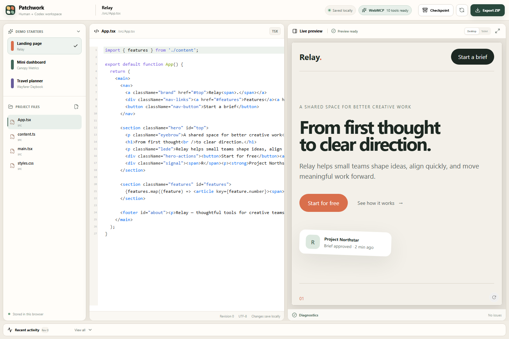

# Patchwork

**A local-first browser canvas where people and their existing Codex session build the same web project, in the same page.**

> Build with Codex, directly inside the page.



Patchwork is an independent project and is not affiliated with or endorsed by OpenAI.

## The problem

Most AI coding tools move the project into the agent's interface or require an extension, another account, an API key, or a separate MCP server. That breaks the shared visual context between the person and the agent.

Patchwork does the inverse. It keeps a small web project in a local browser workspace and exposes precise Site Tools through WebMCP. The person sees files, code, preview, diagnostics, checkpoints, and activity. The agent receives structured reads, atomic writes, revisions, and verifiable results from that exact page.

There is no embedded chatbot, no OpenAI API call, no API key, no account, and no separate MCP server.

## What works

- Three original deterministic starters: landing page, mini dashboard, and travel planner.
- File creation, selection, rename, explicit deletion, and text editing.
- Sandpack React/TypeScript preview with visible compile/runtime diagnostics.
- IndexedDB persistence with a visible, recoverable storage-failure state.
- Automatic checkpoint before every content mutation and manual checkpoints.
- Exact checkpoint restore and deterministic **Reset demo**.
- ZIP export prepared entirely in the browser.
- Compact activity history without file contents.
- Responsive laptop/tablet layout and keyboard-visible controls.
- Graceful `Site tools unavailable in this browser` state.

## Why WebMCP is load-bearing

Without WebMCP, an agent has to infer filenames and application state from pixels, then reproduce human UI gestures one at a time. Patchwork's WebMCP contract provides canonical paths, narrow schemas, current revisions, atomic multi-file changes, checkpoints, diagnostics, and structured errors. The agent can act precisely while the person watches the same workspace change.

The tools are registered imperatively from the top-level document with `document.modelContext.registerTool(...)`. Nothing is registered inside the Sandpack iframe.

| Tool                     | Effect                                                                             |
| ------------------------ | ---------------------------------------------------------------------------------- |
| `get_workspace_context`  | Read starter, revision, file summary, latest checkpoint, preview, and limits       |
| `list_files`             | List canonical text paths and sizes                                                |
| `read_files`             | Read an explicit bounded batch at one observed revision                            |
| `write_files`            | Atomically validate and write a bounded batch with one checkpoint and revision     |
| `move_file`              | Move one explicit file after collision and path validation                         |
| `delete_file`            | Delete one explicit file; no glob or recursive directory operation                 |
| `inspect_preview`        | Read factual compilation/runtime diagnostics without claiming visual understanding |
| `create_checkpoint`      | Save a local snapshot without changing project content                             |
| `restore_checkpoint`     | Preserve current state, then restore an explicit snapshot                          |
| `prepare_project_export` | Validate and describe a ZIP export without starting a download                     |

## Architecture

```text
Human UI ─────┐
              ├─> WorkspaceFacade ─> pure domain validation
Site Tools ───┘          │           + atomic mutation planning
                         ├─> IndexedDB transaction
                         ├─> checkpoints + activity
                         └─> Sandpack preview bridge
```

The UI and Site Tools share the same façade. Read operations never update last-access timestamps, activity, checkpoints, or revisions. Mutations are validated fully in memory before a single IndexedDB transaction persists workspace, checkpoint, and activity.

See [Architecture](docs/ARCHITECTURE.md), [WebMCP implementation](docs/WEBMCP_IMPLEMENTATION.md), and [Security](docs/SECURITY.md).

## Run locally

Requirements: Node.js 20+ and npm.

```bash
npm install
npm run dev
```

Open `http://localhost:5173/?demo=landing`. Other stable scenarios:

- `?demo=dashboard`
- `?demo=travel`

## Validate

```bash
npm run lint
npm run format:check
npm run typecheck
npm run test
npm run build
npx playwright install chromium
npm run test:e2e
npm run scan:secrets
npm run audit:deps
```

## Demo in ChatGPT

1. Open the live Patchwork URL in the ChatGPT desktop app's built-in browser.
2. Select **Site tools** in the address bar and confirm the ten Patchwork tools are available.
3. Use GPT-5.6 Sol or Terra and send:

> Inspect the current project and turn it into a premium landing page for an AI travel assistant called Roamly. Keep it responsive, use a warm Indonesian travel aesthetic, add a clear hero, three feature cards and a strong call to action. Create a checkpoint before editing, inspect the preview afterward, fix any errors you find, then summarize the files you changed.

4. Watch the files, revision, activity, diagnostics, and preview update in Patchwork.
5. Restore the pre-edit checkpoint or export the result.

The current ChatGPT Site Tools implementation requires the latest desktop app, does not discover tools in iframes, and does not support declarative form tools. Availability depends on product rollout and workspace type.

## Security and data

- Project data stays in this browser's IndexedDB and is sent only to Sandpack's isolated preview runtime as needed to compile the preview.
- No Patchwork backend, account, analytics, API key, arbitrary shell, host package installer, or project deployment.
- Canonical relative POSIX paths only; absolute paths, traversal, protocols, globs, null bytes, and ambiguous segments are rejected.
- Text extension allowlist and per-file, batch, file-count, read-result, and workspace-size limits.
- Optimistic revisions prevent silent overwrites.
- Logs contain paths and summaries, never file contents.
- The host application does not use `eval` or inject workspace content into its DOM.

The Sandpack runtime is a CodeSandbox-hosted iframe, so project source is processed by that third-party preview service. Do not place secrets or sensitive production code in this hackathon demo. See the full [threat model](docs/SECURITY.md).

## Limits

Patchwork is intentionally a small-project demo. It supports allowlisted text files and a constrained Sandpack preview, not a host package manager, binary assets, large repositories, remote shells, accounts, private GitHub sync, or deployment of the project being edited. `inspect_preview` reports technical diagnostics; it does not claim computer vision.

## Challenge links

- Live demo: **pending deployment verification**
- Public repository: **pending publication verification**
- Demo video: **pending manual recording and public YouTube upload**
- [Official requirements evidence](docs/HACKATHON_REQUIREMENTS.md)
- [Demo runbook](docs/DEMO_RUNBOOK.md)
- [Video script](docs/VIDEO_SCRIPT.md)
- [Devpost copy](docs/DEVPOST_SUBMISSION.md)

## License

[MIT](LICENSE) © 2026 Damien Credoz.
