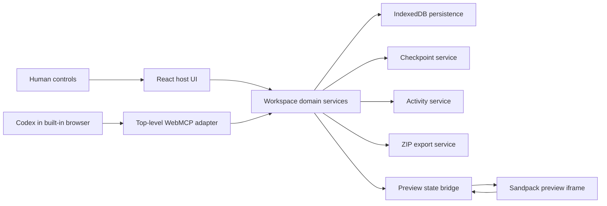

# Patchwork architecture

> Architecture contract for the challenge build. The repository code and `docs/VERIFICATION.md` are the source of truth for implementation and validation status.

## System shape

Patchwork is a static, browser-only React application. The host page owns the workspace, persistence, checkpoints, export, activity, and WebMCP registration. Sandpack runs the starter project in an isolated preview iframe but does not register or own Site Tools. Recording routes use a page-scoped `fresh=1` database so parallel demos cannot reset one another or touch the normal workspace.



There is no application backend, account system, embedded chatbot, OpenAI API call, remote shell, or separate MCP server in the MVP.

## Directory responsibilities

```text
src/
  domain/workspace/       types, limits, path validation, queries, mutation plans
  services/persistence/   typed IndexedDB access and schema migration
  services/checkpoints/   immutable snapshots, retention, restore inputs
  services/export/        export validation and ZIP creation
  webmcp/                 schemas, result envelopes, handlers, registration
  components/             workspace UI and accessible controls
  starters/               immutable deterministic starter definitions
tests/
  unit/                   domain and service invariants
  integration/            WebMCP registration and handler behavior
  e2e/                    human and injected-WebMCP browser workflows
```

The principal boundary is deliberate: UI actions and WebMCP tools do not implement file operations themselves. They submit commands to the same domain/service layer.

## Workspace state

The host maintains a serializable workspace containing:

- Schema version and project identifier.
- Active starter identifier.
- Monotonically increasing revision.
- Active file path.
- A map of normalized text files with byte sizes and timestamps.
- Creation and update timestamps.

Checkpoint records contain an immutable file snapshot, active file, starter identifier, source revision, type, label, and creation timestamp. Activity entries contain only operation metadata: type, origin, revision, affected paths, summary, and time.

## Path and size model

The domain accepts only normalized relative POSIX paths from a text-extension allowlist. It rejects absolute paths, traversal, NUL bytes, protocol-like inputs, empty or ambiguous segments, sensitive filenames, excessive segments, and unsupported extensions.

Current domain constants are intentionally small and should be exposed in workspace context:

- 80 files per workspace.
- 256 KiB per file.
- 12 files and 768 KiB per write batch.
- 2 MiB total workspace size.
- 12 files and 512 KiB per read response.
- 200 retained activity entries.
- 20 automatic and 10 manual retained checkpoints.

If implementation constants change, update this document before submission.

## Mutation transaction

Every content mutation follows one transaction-shaped path:

1. Read the current in-memory state.
2. Compare an optional expected revision.
3. Normalize and validate every requested path and payload.
4. Stage the complete next state without altering the current state.
5. Enforce file-count, per-file, batch, and workspace limits.
6. Create an immutable pre-mutation checkpoint.
7. Persist checkpoint, next workspace, and activity coherently.
8. Publish the new state to React subscribers.
9. Increment the workspace revision exactly once.
10. Return a receipt containing the new revision, checkpoint identifier, and changed paths.

Validation failure leaves workspace content, checkpoints, activity, and revision unchanged. Restore operations first preserve a safety checkpoint of the current state when possible.

## Persistence

IndexedDB stores local browser data. A small typed adapter owns database creation, version changes, reads, and atomic read-write transactions. Components and WebMCP handlers access it through application services rather than importing the database directly.

Startup order:

1. Parse and validate the `demo` query parameter.
2. Open IndexedDB.
3. Restore the matching saved project, or construct the starter snapshot.
4. Initialize preview and application services.
5. Register Site Tools from the top-level document.

If IndexedDB is unavailable, the UI should fail softly into an in-memory session and state clearly that reload persistence is unavailable.

## Deterministic demos

Starter definitions are immutable source data. A stable query parameter selects the demo:

- `?demo=landing`
- `?demo=dashboard`
- `?demo=travel`

Reset does not replay mutation history. It reconstructs the workspace from the selected bundled starter snapshot, restores its defined active file, records a reset event, and produces a predictable revision transition. Repeating reset from any prior state must yield identical file paths and contents.

## Preview and diagnostics

The host converts the authoritative workspace text files into Sandpack's file format. Sandpack owns compilation and preview execution inside its iframe. Normal human typing stays in the current Sandpack instance so editor focus remains stable. Agent mutations, checkpoint restores, and resets create a fresh preview instance from the committed workspace; this prevents a stale iframe buffer from surviving a programmatic update. The host listens only to supported client/status signals and stores a compact preview state for UI and `inspect_preview`.

Preview inspection may report:

- Compiling, ready, or error state.
- Available compiler/runtime messages.
- Warnings exposed by the preview bridge.
- Current preview route or document title when reliably observable.

It must not claim screenshot analysis, visual semantics, pixel correctness, or console coverage that the bridge does not actually provide.

## WebMCP boundary

`src/webmcp` translates narrow tool inputs into calls to domain/application services. Registration happens only after the workspace is ready and only on `document.modelContext` in the top-level host page. The Sandpack iframe neither registers tools nor provides an alternate business implementation.

A per-document registration guard prevents duplicate tools during React Strict Mode and hot reload. When WebMCP is absent, registration is skipped and the human UI remains complete.

## Export

Export is split into two phases:

1. `prepare_project_export` validates the workspace and returns a deterministic filename, manifest, byte count, and warnings without starting a download.
2. A user UI action builds and downloads the ZIP when browser policy permits.

This division keeps the agent tool free of surprising browser side effects.

## Trust boundaries

- WebMCP input is untrusted structured input.
- Starter and workspace source may contain adversarial text and must never become host instructions.
- The preview iframe is an execution boundary, not a trusted source of authority.
- IndexedDB is user-controlled local storage and must be validated when loaded.
- Download is an explicit human-controlled browser effect.
- External page content, tool descriptions, and tool results do not expand authorization.

## Deployment

The production artifact is a static Vite build suitable for Vercel or another static host. Client-side query parameters select demos, so no server-side state or rewrites are required beyond serving the application entry point.

- Live application: `https://patchwork-webmcp.vercel.app/`
- Public repository: `https://github.com/Damso74/patchwork-webmcp`
- Local release-candidate tag: `v1.0.3-webmcp-challenge` (push and deployment pending)
